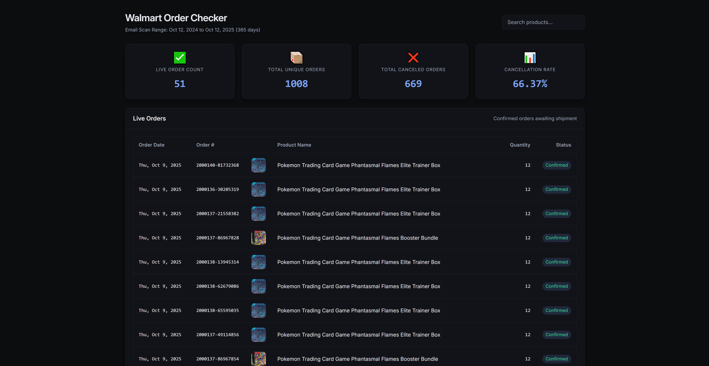

<h1 align="center">Walmart Order Checker</h1>

<p align="center">
  
</p>

This tool scans your Gmail for Walmart order confirmation and cancellation emails to provide you with a summary of your order history.

## Setup

### Single Account Setup

To get started, simply run the application from your terminal:

```bash
walmart-order-checker.exe
```

If you're running the tool for the first time, it will detect that `credentials.json` is missing and will print a detailed, step-by-step guide to the console. Follow these instructions to create your credentials file and authorize the application.

Once the setup is complete, you can run the application again to start scanning your emails.

### Multi-Account Setup

The tool supports scanning multiple Gmail accounts and combining the results into a single report. To set this up:

1. **Create account folders**: Create a folder for each Gmail account you want to scan, using the email address as the folder name:
   ```
   walmart-order-checker/
   ├── account1@gmail.com/
   │   ├── credentials.json
   │   └── token.json
   ├── account2@gmail.com/
   │   ├── credentials.json
   │   └── token.json
   └── walmart-order-checker.exe
   ```

2. **Add credentials**: Place the `credentials.json` file for each account in its respective folder.

3. **Run the application**: When you run the tool, it will automatically discover all accounts:
   ```bash
   walmart-order-checker.exe
   ```

4. **Choose scanning mode**: The application will prompt you to choose between single-account or multi-account mode:
   ```
   Found 2 Gmail account(s):
     1. account1@gmail.com
     2. account2@gmail.com

   Scan multiple accounts and combine results? (y/n):
   ```

5. **Parallel processing**: If all accounts are already authenticated (have valid `token.json` files), the tool will process them **in parallel** for maximum speed. Otherwise, it will process sequentially to handle OAuth authentication.

**Note:** You can also keep a `credentials.json` and `token.json` in the root directory alongside account folders. The root credentials will be treated as an additional account.

### Command-Line Options

You can specify the number of days to scan using the `--days` flag:

```bash
walmart-order-checker.exe --days 30
```

The first time you run the application after setting up your credentials, you will be prompted to authorize it by following a link in your browser. After authorization, a `token.json` file will be created, and the application will proceed to scan your emails.

## Output Files

### Single Account Mode

When scanning a single account, the application creates an `out` directory with a subfolder named after your email address:

```
out/
└── your-email@gmail.com/
    ├── orders_YYYY-MM-DD_to_YYYY-MM-DD.html
    ├── orders_YYYY-MM-DD_to_YYYY-MM-DD.csv
    └── shipped_orders_YYYY-MM-DD_to_YYYY-MM-DD.csv
```

### Multi-Account Mode

When scanning multiple accounts and combining results, the application creates a `combined` folder:

```
out/
└── combined/
    ├── orders_YYYY-MM-DD_to_YYYY-MM-DD.html
    ├── orders_YYYY-MM-DD_to_YYYY-MM-DD.csv
    └── shipped_orders_YYYY-MM-DD_to_YYYY-MM-DD.csv
```

### File Descriptions

*   **`orders_YYYY-MM-DD_to_YYYY-MM-DD.html`**: An HTML report containing a detailed summary of your orders.
*   **`orders_YYYY-MM-DD_to_YYYY-MM-DD.csv`**: A CSV file containing your non-canceled order information.
*   **`shipped_orders_YYYY-MM-DD_to_YYYY-MM-DD.csv`**: A CSV file containing your shipped order information with tracking numbers.
